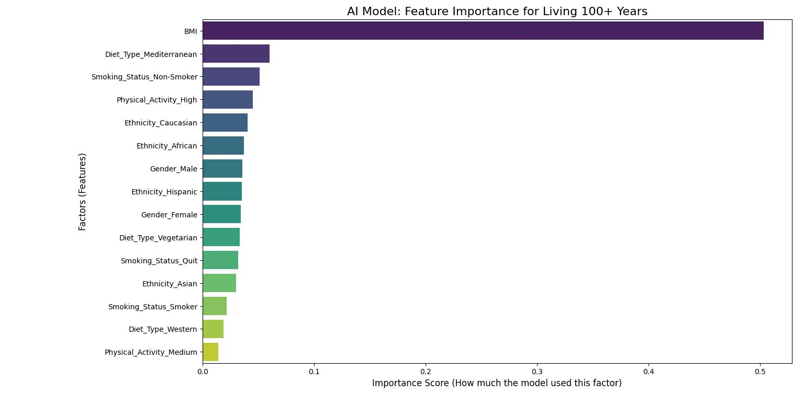

# 🤖 AI Project: Predicting 100+ Year Lifespans

This is a simple project for an "AI in Biology" 🧬 course. We want to answer the question: **"What are the most important factors for living 100+ years?"**

To answer this, we create a sample (synthetic) dataset of 1000 people. Then, we use a machine learning model to find the most important patterns in the data.

-----

## 📊 1. The (Synthetic) Data

Our model did not use real-world data. We created a synthetic dataset with 1000 "virtual" people. This was necessary because real-world data for 100+ year-olds is rare.

Each person in our dataset has these features (characteristics):

  * **`Gender`**: (Female, Male) 👩‍🦰👨‍🦰
  * **`Diet_Type`**: (Mediterranean 🥗, Western 🍔, Vegetarian 🥦)
  * **`Smoking_Status`**: (Smoker 🚬, Non-Smoker 🚭, Quit)
  * **`Physical_Activity`**: (High 🏃‍♀️, Medium, Low 🛋️)
  * **`BMI`**: A number (e.g., 24.5) representing body mass index.
  * **`Ethnicity`**: (Caucasian, Asian, African, Hispanic)

Our model's goal was to look at all these features and predict one target:

  * **`Long_Lived_100`**: (1 for Yes 👍, 0 for No 👎)

-----

## 💻 2. Technology Used

  * **Python:** The main programming language.
  * **Pandas:** We used this to create and manage the synthetic dataset.
  * **Scikit-learn (sklearn):** We used this library to build our AI model, a `RandomForestClassifier`.
  * **Matplotlib & Seaborn:** We used these to create the final results graph.

-----

## 📈 3. Results: What Did the AI Learn?

After training the model, we asked it, "Which features were most important for your decisions?" The graph below shows the answer. This is called **"Feature Importance."**

It shows how much the model "used" each factor when deciding if a person would live past 100.

### Analysis



From this graph, we can see the model's top 3 factors:

1.  🥇 **BMI:** This was the **most important factor** by far. The model paid a lot of attention to the person's body mass index.
2.  🥈 **Diet\_Type\_Mediterranean:** The second most important factor was whether the person followed a Mediterranean diet.
3.  🥉 **Smoking\_Status\_Non-Smoker:** The third most important factor was whether the person was a non-smoker.

Other factors, like being a "Smoker" or having "Medium" activity, were less important for the model's final prediction.

-----

## 🚀 4. How to Run This Project

1.  You must have Python and the libraries (pandas, sklearn, matplotlib, seaborn) installed.
2.  Save the Python code (from our previous conversation) as a file, for example: `run_model.py`.
3.  Run the script from your terminal:
    ```bash
    python run_model.py
    ```
4.  The script will train the model, print the results, and save the graph as an image.

-----

## ⚠️ 5. Project Limitations

This is a very important point:
**The data is 100% synthetic (fake).**

We created the rules in the code (for example, we told the code that "smoking is bad" and "Mediterranean diet is good"). The AI model did not *discover* a new rule about biology; it simply *re-learned* the patterns that we put into the data.

This project is an exercise to show **how** an AI model can find patterns, not a real biological discovery.