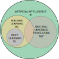

# Lecture 1: Introduction to AI in Biology
**Date:** 2025-09-22  

---

## 1. What is Artificial Intelligence (AI)?
- **Definition:** The simulation of human intelligence in machines that are programmed to think, reason, and learn.  
- **Key idea:** Build systems that can *perceive*, *reason*, *act*, and *learn*.  
- **Subfields of AI:**  
  - Natural Language Processing (NLP)  
  - Computer Vision  
  - Robotics  
  - Expert Systems  

---

## 2. AI vs. ML vs. DL

- **Artificial Intelligence (AI):** Broad field aiming to create intelligent systems.  
- **Machine Learning (ML):** Subset of AI; algorithms that learn patterns from data.  
- **Deep Learning (DL):** Subset of ML; multi-layer neural networks that handle high-dimensional and unstructured data.  

**Analogy:**  
AI = the goal → ML = the approach → DL = the most advanced set of techniques.  

---

## 3. Why Biology Needs AI
- **Complexity of biological systems:**  
  - Multiscale (molecules → cells → tissues → organisms → ecosystems).  
  - High variability and noise in data.  
- **Explosion of biological data:**  
  - Genomics: billions of DNA bases sequenced.  
  - Imaging: terabytes of MRI, CT, microscopy.  
  - Clinical data: electronic health records, wearable devices.  
- **Traditional analysis is insufficient** → AI helps uncover hidden patterns.  

---

## 4. Major Applications of AI in Biology
1. **Genomics & Bioinformatics**  
   - Variant calling, genome annotation, gene expression prediction.  
   - AI helps map genotype → phenotype relationships.  

2. **Medical Imaging**  
   - Radiology: cancer detection in CT/MRI.  
   - Pathology: automatic classification of tissue samples.  

3. **Drug Discovery**  
   - Virtual screening of molecules.  
   - Protein structure prediction (AlphaFold).  
   - Personalized medicine approaches.  

4. **Systems Biology**  
   - Modeling interactions in biological networks.  
   - Predicting system-level behavior from molecular data.  

---

## 5. Ethical and Practical Considerations
- **Interpretability:** AI models must be explainable in biology/medicine.  
- **Bias in data:** Risks of non-representative datasets.  
- **Privacy:** Sensitive genomic and health data require secure handling.  
- **Clinical validation:** From algorithm → to bedside requires regulation.  

---

## Reading
- Ching, T., et al. (2018). *Opportunities and obstacles for deep learning in biology and medicine*. Journal of The Royal Society Interface.  
- Russell & Norvig. *Artificial Intelligence: A Modern Approach*. (Introductory sections).  
- Jumper et al. (2021). *Highly accurate protein structure prediction with AlphaFold*. Nature.  

---

## Notes
- AI in biology = **partnership between data-driven computation and biological insight**.  
- Early focus: general AI background → later focus: case studies in biology.  
- This course will require both **technical understanding** (algorithms, models) and **biological literacy** (genomics, systems, medical relevance).  
- First step: build conceptual clarity → next, dive into tools and applications.  
